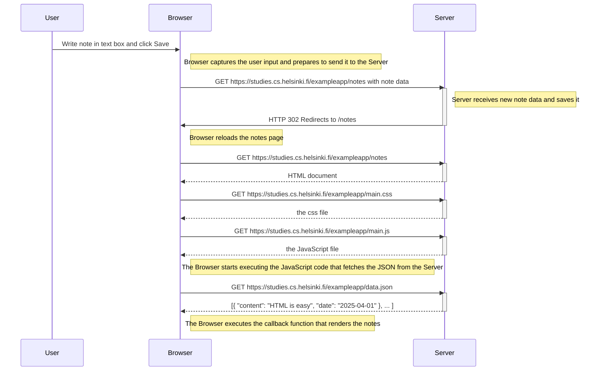

```mermaid
sequenceDiagram
    participant User
    participant Browser
    participant Server
    

    User->>Browser: Write note in text box and click Save
    Note right of Browser: Browser captures the user input and prepares to send it to the Server

    Browser->>Server: GET https://studies.cs.helsinki.fi/exampleapp/notes with note data

    activate Server
    Note right of Server : Server receives new note data and saves it
    Server->>Browser: HTTP 302 Redirects to /notes
    deactivate Server
    Note right of Browser: Browser reloads the notes page

    Browser->>Server: GET https://studies.cs.helsinki.fi/exampleapp/notes
    activate Server
    Server-->>Browser: HTML document
    deactivate Server

    Browser->>Server: GET https://studies.cs.helsinki.fi/exampleapp/main.css
    activate Server
    Server-->>Browser: the css file
    deactivate Server

    Browser->>Server: GET https://studies.cs.helsinki.fi/exampleapp/main.js
    activate Server
    Server-->>Browser: the JavaScript file
    deactivate Server

    Note right of Browser: The Browser starts executing the JavaScript code that fetches the JSON from the Server

    Browser->>Server: GET https://studies.cs.helsinki.fi/exampleapp/data.json
    activate Server
    Server-->>Browser: [{ "content": "HTML is easy", "date": "2025-04-01" }, ... ]
    deactivate Server

    Note right of Browser: The Browser executes the callback function that renders the notes
   

```