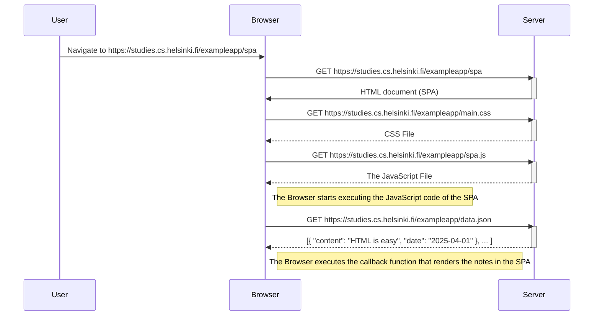

```mermaid
sequenceDiagram
    participant User
    participant Browser
    participant Server

    User->>Browser: Navigate to https://studies.cs.helsinki.fi/exampleapp/spa
    

    Browser->>Server: GET https://studies.cs.helsinki.fi/exampleapp/spa

    activate Server
    Server->>Browser: HTML document (SPA)
    deactivate Server

    Browser->>Server: GET https://studies.cs.helsinki.fi/exampleapp/main.css
    activate Server
    Server-->>Browser: CSS File
    deactivate Server

    Browser->>Server: GET https://studies.cs.helsinki.fi/exampleapp/spa.js
    activate Server
    Server-->>Browser: The JavaScript File
    deactivate Server

    Note right of Browser: The Browser starts executing the JavaScript code of the SPA

    Browser->>Server: GET https://studies.cs.helsinki.fi/exampleapp/data.json
    activate Server
    Server-->>Browser: [{ "content": "HTML is easy", "date": "2025-04-01" }, ... ]
    deactivate Server

    Note right of Browser: The Browser executes the callback function that renders the notes in the SPA
   

```