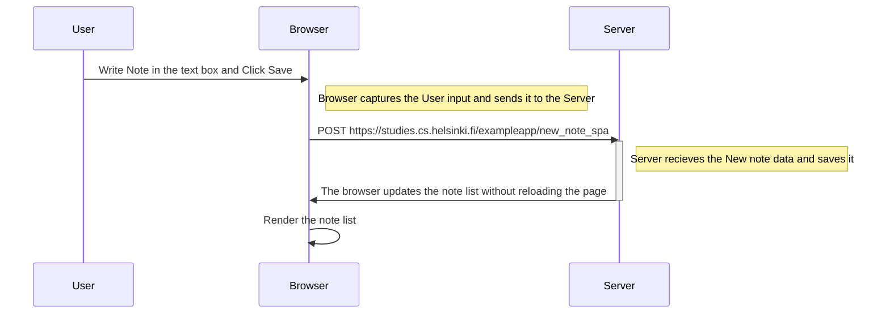

```mermaid
sequenceDiagram
    participant User
    participant Browser
    participant Server

    User->>Browser: Write Note in the text box and Click Save
    Note right of Browser: Browser captures the User input and sends it to the Server

    Browser->>Server: POST https://studies.cs.helsinki.fi/exampleapp/new_note_spa

    activate Server
    Note right of Server: Server recieves the New note data and saves it
    Server->>Browser: The browser updates the note list without reloading the page
    deactivate Server

    Browser->>Browser: Render the note list

```